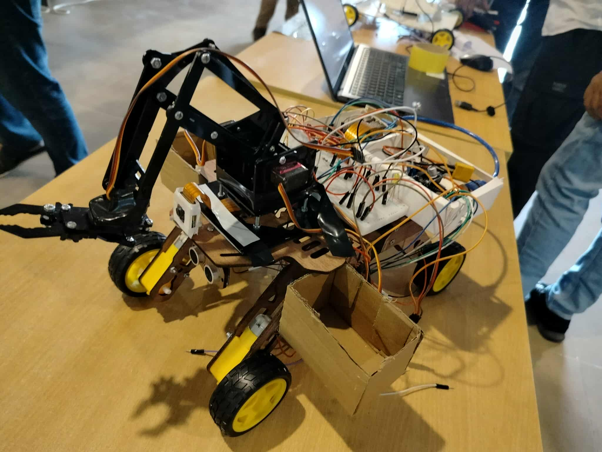

# EcoRover — AI-Powered Autonomous Waste Collection Robot

EcoRover is an intelligent robotic system designed to **detect and collect recyclable waste** using computer vision and robotics.

The system integrates **YOLO-based object detection**, **Raspberry Pi edge computing**, **Arduino-based motor control**, and a **4-DOF robotic arm** to automatically identify and collect recyclable materials.

Currently, EcoRover can detect and collect three types of waste:

- Plastic  
- Paper  
- Aluminum  

The goal of this project is to explore how **AI + robotics** can help automate waste sorting and contribute to a cleaner environment.

---

# Project Overview

EcoRover combines **embedded systems, computer vision, and robotics** into a single autonomous platform.

### Workflow

1. The camera captures real-time images  
2. The **YOLOv11n model** detects recyclable objects  
3. The **Raspberry Pi** processes detection results  
4. The **Arduino** controls rover navigation and obstacle avoidance  
5. The **robotic arm** collects the detected waste  

This project demonstrates how **edge AI can be integrated with robotics for real-world applications**.

---

---
# Demo


```

```

---


# System Architecture

```
Camera → Raspberry Pi (YOLO Inference) → Arduino Controller → Motors + Robotic Arm
```

---

# Hardware Components

| Component | Description |
|-----------|-------------|
| Raspberry Pi | Runs YOLO model for real-time object detection |
| Arduino | Controls rover movement and sensors |
| Camera Module | Captures images for object detection |
| L298N Motor Drivers | Drives the BO motors for locomotion |
| 6-Wheel Chassis | Robot platform with BO motors |
| BO Motors | Provide movement for the rover |
| 4-DOF Robotic Arm | Picks up detected waste objects |
| MG90S Servo Motors | Control the robotic arm joints |
| Ultrasonic Sensor | Enables obstacle avoidance |
| 3S LiPo Battery | Main power source for the rover |

---

# AI Model

The object detection system is built using **YOLOv11n** trained on a **custom synthetic dataset**.

### Dataset Classes

- Plastic  
- Paper  
- Aluminum  

### Training Results

| Parameter | Value |
|-----------|------|
| Model | YOLOv11n |
| Dataset | Custom Synthetic Dataset |
| Detection Accuracy | **80%+** |
| Deployment Device | Raspberry Pi |

---

# Hardware Design

## Rover Platform

- 6-wheel robotic chassis  
- BO motors for locomotion  
- Dual **L298N motor drivers**

## Robotic Arm

- **4 Degrees of Freedom**
- **MG90S servo motors**
- Designed for lightweight waste pickup

During testing several servos failed due to torque limitations, but the final configuration achieved stable motion and pickup capability.

---

# Power System

The rover is powered by a **3S LiPo battery**.

Different components required different voltage levels:

- Motor drivers (L298N)
- Servo motors (MG90S)
- Raspberry Pi

Voltage regulation was implemented to stabilize the system.

---

# Experimental Results

EcoRover was tested with three types of recyclable waste:

- Plastic  
- Paper  
- Aluminum  

The rover successfully:

- Detected waste using YOLO  
- Navigated toward the target  
- Picked the object using the robotic arm  

Although still a prototype, EcoRover demonstrates the feasibility of **autonomous waste collection robots**.


---

# License

This project is licensed under the **MIT License**.
